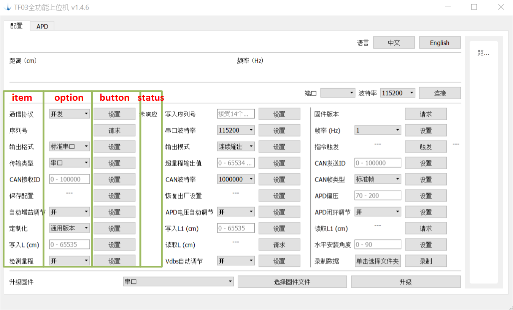

## TF03全功能上位机设计文档

#### 框架

```
+-----------+
| MainWinow |
+-----------+
      |
     构建
      V
+---------------------------+
| CommandEchoWidgetsManager |
+---------------------------+
            |
          构建
            |
-------------
|
|     +---------------------+
|---> | SetFrequencyWidgets |---|
|     +---------------------+   |
|     +---------------------+   |
|---> | OutputSwitchWidgets |---|
|     +---------------------+   |
|     +--------------------+    |
|---> | SetPortTypeWidgets |----|
|     +--------------------+    |
|------------> .                |
|------------> .                |
|------------> .                |
                               继承
+--------------------+          |
| CommandEchoWidgets |<---------|
+--------------------+
          ^
         服务
          |
          |------------------
          |                 |
+--------------------+      |
| CommandEchoHandler |      |
+--------------------+      |
          ^                 |
     提供抽象数据包          服务
          |                 |
      +--------+            |
      | Driver |-------------
      +--------+
          ^
      获取原始数据
      解析原始数据
    打包成抽象数据包
          |
====== 串口协议 =======
          |         
       TF03设备
```

#### 宏编译选项

| 宏                           | 功能                   |
| ---------------------------- | ---------------------- |
| SUPPORT_DEVEL_MODE_PROTOCOL_ | 支持开发模式           |
| USE_APD_EXPERIMENT_PAGE      | 显示APD电压检测页面    |
| CLIENT_BL_CUSTOMIZATION      | 支持BL等客户定制功能   |
| DISPLAY_PLOT_ON_SETUP_PAGE   | 主界面显示实时距离曲线 |

#### CommandEchoWidgets类

一个`CommandEchoWidgets`控件包括`item`，`option`，`button`，`status`四个部件。一般根据实际需要，使用不同的QWidget控件实现option。例如，`通信协议`的option为一个QCombo类型的下拉菜单控件；而`写入序列号`的option为一个QLineEdit类型的输入框。



一个CommandEchoWidget的基本接口如下。

```c++
struct CommandEchoWidgets : public QObject
{
  char id;
  QLabel* item;
  QWidget* option;
  QPushButton* button;
  QLabel* status;

  Lingual item_lingual;
  Lingual button_lingual;
  virtual void SetOptionLingual();
  Lingual status_lingual;

  virtual void Update();

  std::shared_ptr<Driver> driver;
  std::shared_ptr<CommandEchoHandler> echo_handler;

  int timeout;

 protected:
  virtual void ButtonClicked();
};
```

`id`为该设置项在《TF03下位机指令协议》中对应的指令ID。

`Lingual`类型为本项目自定义的多语言字符串类。目前支持英文和汉语。可按如下方式初始化。

```c++
Lingual lingual = {"An English String", "一个中文字符串"};
```

`timeout`为命令响应超时，单位毫秒。

`ButtonClicked`为button按钮按下时的回调函数。

`Update`为更新回调函数。

`SetOptionLingual`为软件语言改变时的回调函数。

#### 添加一个设置控件

以设置`传输类型`控件`SetPortTypeWidgets`为例，为TF03 Setup上位机添加该控件的必要步骤如下。

1. 实现一个CommandEchoWidgets类

   在"command_echo_widgets.h"头文件中声明`CommandEchoWidgets`类。

   ```c++
   struct SetPortTypeWidgets : public CommandEchoWidgets {
     SetPortTypeWidgets();
     void ButtonClicked() override;
     void SetOptionLingual() override;
     static int ID();
     QComboBox* combo;
     const Lingual kSerial = {"Serial Port", "串口"};
     const Lingual kCAN = {"CAN", "CAN"};
   };
   ```

   其中，`combo`为“串口/CAN”的下拉菜单控件。`kSerial`与`kCAN`为“串口/CAN”选项的Lingual双语字符串。

   `SetPortTypeWidgets`为该控件的构造函数，其实现如下。

   ```c++
   SetPortTypeWidgets::SetPortTypeWidgets() {
     // 通过为id赋值，将该控件与相应的下位机指令绑定。
     id = 0x45;
     // 通过为item_lingual负值更改item标签文字。
     item_lingual = {"Port Type", "传输类型"};
     // 构建combo
     combo = new QComboBox;
     // 将option指定为combo
     option = combo;
   }
   ```

   CommandEchoWidgets还重载了按钮点击回调函数`ButtonClicked`以及软件语言改变时的回调函数`SetOptionLingual`。

   ```c++
   void SetPortTypeWidgets::ButtonClicked() {
     // 如无特殊要求，需执行父类的接口以执行重置计时器等默认操作。
     CommandEchoWidgets::ButtonClicked();
     // 获取combo当前字符串。
     auto type = combo->currentText();
     // lingual_equal为比较QString与Lingual在当前语言下是否相同的帮助函数。
     if (lingual_equal(type, kSerial)) {
       // 调用driver的“使用串口通信”接口
       driver->SetTransTypeSerial();
     } else if (lingual_equal(type, kCAN)) {
       // 调用driver的“使用CAN通信”接口
       driver->SetTransTypeCAN();
     }
   }
   ```

2. 将SetPortTypeWidgets载入 CommandEchoWidgetsManager

   在”command_echo_widgets_manager.cpp“中构建并添加SetPortTypeWidgets。

   ```
   void CommandEchoWidgetsManager::LoadWidgets() {
     // ...
     AddWidgets(
         std::shared_ptr<SetPortTypeWidgets>(new SetPortTypeWidgets));
     // ...
   }
   ```