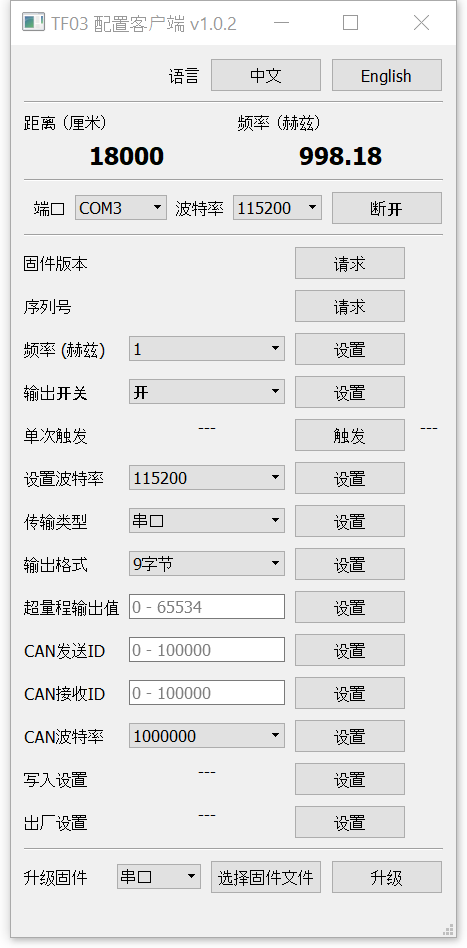

## TF03 配置客户端使用说明

#### 界面

#### 设备连接

当TF03传感器为用户电脑上唯一连接的串口设备时，客户端会自行连接该传感器。否则用户需要自行选择端口，并手动点击连接按钮。

#### 实时数据显示

当客户端成功读取到传感器数据时，会将获取的距离以及获取的数据帧率显示在界面上。当传感器断开，或获取数据失败时，距离及帧率信息会消失。

#### 配置选项

所有配置选项均包含设置（或触发）按钮。点击按钮后客户端会等待传感器响应，期间该按钮将处于不可点击状态。如果传感器成功响应，客户端会在按钮右边显示其响应状态。如果长时间无响应，客户端会提示“未响应”，并恢复按钮至可点击状态。注意，在使用所有配置功能时，建议将频率调低，或关闭输出，否则客户端可能无法正常获取传感器响应。

- 固件版本

  获取传感器固件版本

- 序列号

  获取传感器序列号

- 频率

  设置传感器输出频率

- 输出开关

  设置传感器是否输出数据

- 单次触发

  指令传感器输出一帧数据

- 设置波特率

  设置传感器波特率。设置后，需手动更改客户端波特率并重新连接传感器。

- 传输类型

  设置串口输出或CAN输出

- 输出格式

  设置标准九字节输出或按照Pixhawk格式输出

- 超量程输出值

  设置输出距离超过量程时的输出距离

- CAN发送ID

  设置CAN模式下的发送ID

- CAN接收ID

  设置CAN模式下的接收ID

- CAN波特率

  设置CAN波特率

- 写入设置

  使传感器保存其当前设置

- 出厂设置

  使传感器恢复出厂设置

#### 升级固件

升级固件前，需选定当前通信接口类型（串口或CAN）。如果选择的类型与传感器输出的通信接口不同时，会导致升级失败。然后需点击“选择固件文件”选取有效的固件文件。当该按钮变为“固件文件就绪”时，可以点击升级按钮，并等待进度条完成。当升级失败时，升级按钮右侧会显示升级失败。客户端启动后第一次点击升级按钮后会出现提示对话框，请认真阅读并执行所示的提示。